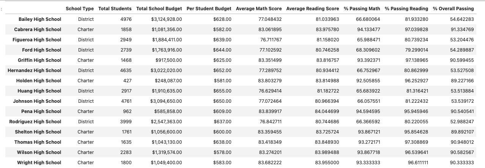
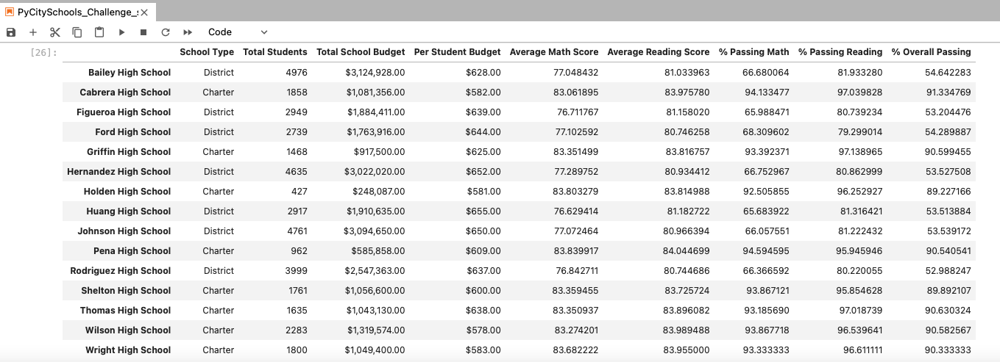

# School District Analysis

## Overview

This analysis was completed to investigate suspicions in the grades of 15 schools within the district.  There were some suspicions of academic dishonesty within the 9th grade students of Thomas High School (THS) of this district.  To determine the impact of the data including and excluding the 9th grade group of THS and the other schools, an analysis of the student grades for the district was completed to evaluate the impact of the performance of the schools by comparing the performance of this district with and without the suspected group. The data was then summarized to allow for the analysis of the effect on the overall evaluation of the schools within the district.

## Areas of Analysis

For this analysis a CSV file containing the math and reading scores of all the students within the district was combined with a dataset containing the broader school data for the district. An analysis of the school's performance was completed to provide summaries for the following areas:

1. District summary
2. School Performance summary
3. Grouping of the Highest and Lowest performing schools
4. Math and Reading scores by grade
5. Student scores by school spending
6. Student scores by school size
7. Student scores by school type

These summaries were to determine the effect of the group of 9th grade student scores from Thomas High School had on the overall analysis of the district. To determine the effect this, their scores were removed from the analysis and the performance of the school was compared to that of the other schools within the district based on differences observed between the two seperate analysis completed of the students. Using this new data set and analysis of the performance of the schools with and without the suspected group could be completed. This analysis was completed using Pandas module in Python to clean and modify the data to complete the analysis.  The [original](PyCitySchools_Challenge_first_analysis.ipynb) and [modified](PyCitySchools_Challenge_.ipynb) analysis are included within this repository.

---

# Analysis Results

## School District Impact

Based on the analysis of the district with and without the 9th grade students at Thomas High School, the overall impact was minimal. It shows a roughly 0.1% impact in the overall student performance in Math and a 0.2% overall performance in Reading compared to the overall student data within the district before the removal of the scores. (attach image here )

## School Summary Impact

A deeper analysis of the impact of the 9th grade students of THS across the other schools within the district to see if there was an enough of an effect to warrant further action.

Based on the impact of THS data removal, there was a little effect on the performance of the schools with the removal of the scores of the suspected group of students of the school regarding the percentage of students passing the math and reading requirements vs. those that have passed math and reading overall.  This small variation was observed in the school summary developed in the analysis that was completed with and without the group of students in the analysis. Below shows the differences observed between the two DataFrames. 

### Initial Analysis Overall School Performance

### Revised Analysis Overall School Performance

## THS Performance Impact

The performance of THS was significantly impacted by the removal of the 9th grade student scores.  Looking at the overall performance of THS with the grade 9 student scores there appears to be a small reduction of the overall student performance. With the analysis excluding the 9th grade student from the overall performance of THS in the school district there was an approximate 0.09% reduction in the math scores and a 0.29% reduction in reading scores in THS with the grade 9 students removes. A summary of the data is shown below

The remove of the 9th grade students had no significant effect of the overall school performance within the district as seen in the image below

### Initial Analysis School Ranking - Top 5 and Bottom 5
"Attached image here"

### Revised Analysis School Ranking - Top 5 and Bottom 5
"Attached image here"

## Impact of Student Scores Across the District

Based on the removal of the 9th grade student score for Math and Reading there was no significant effect on the ranking of THS in based on school budget school size or school type. This is shown it the images below which show the variations of the data that includes or removes the 9th grade THS data.

---

---